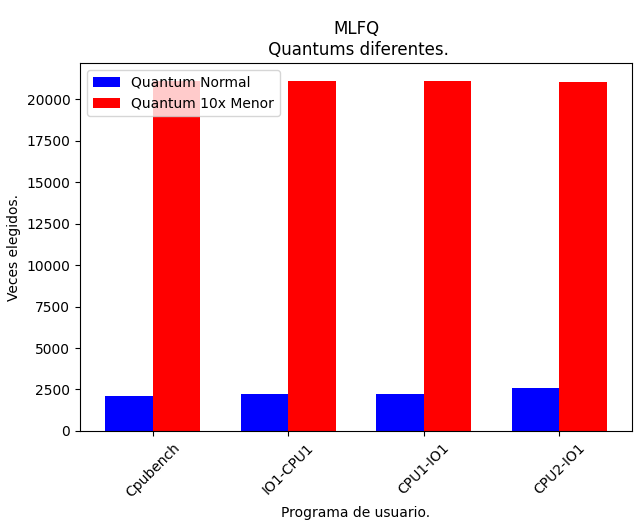

**INFORME: LAB 3.**

**Integrantes:** Fernandéz Nicolás, Galindo Guadalupe, Jimenez Felipe, Longhi Fabrizio.

***Primera Parte:***

**1. ¿Qué política de planificación utiliza xv6-riscv para elegir el próximo proceso a ejecutarse? Pista: xv6-riscv nunca sale de la función scheduler por medios “normales”.**

La política de planificación que utiliza xv6 es Round Robin. La misma contiene todos los procesos en una tabla que se va recorriendo para ejecutar los mismos.. La función scheduler nunca sale de manera normal, los procesos se ejecutan y cambian entre sí de manera cíclica dentro del bucle, manteniendo el sistema en funcionamiento. La salida de la función se logra cuando se detiene el sistema operativo, al apagarlo o reiniciarlo. 

**2. ¿Cuánto dura un quantum en xv6-riscv?**

La duración del quantum se establece en start.c, más específicamente en este trozo del código:

“int interval = 1000000; // cycles; about 1/10th second in qemu”

En el mismo se define la cantidad de ciclos de temporizador que deben pasar para que haya una interrupción, 0,1 segundos en qemu. Sin embargo, el tiempo real va a depender de cada procesador, ya que para calcular la duración de UN solo ciclo de temporizador, necesitamos saber la frecuencia del reloj del procesador, que se mide en hercios (Hz), y luego dividir esta frecuencia por la cantidad de ciclos necesarios para que el temporizador incremente en uno.

**3. ¿Cuánto dura un cambio de contexto en xv6-riscv?**

El cambio de contexto se realiza en el archivo swtch.S, donde se guardan los registros del proceso anterior, y se leen los archivos del proceso próximo a ejecutarse. Para esto, se realizan 28 instrucciones que acceden a memoria, cuyo tiempo lo determina el procesador que se esté usando.

A partir de la idea anterior, fuimos alterando el tamaño del quantum hasta que llegó un punto en el que los procesos no se ejecutaban. De esta manera podemos aproximar que el tiempo de context switch tiene un valor de entre 50 y 100 ticks.

**4. ¿El cambio de contexto consume tiempo de un quantum?**

Si, el context switch consume quantum ya que los timer interrupt ocurren luego de cierto tiempo y el tamaño del quantum está relacionado con ese intervalo de tiempo. El cambio de contexto usa una pequeña porción del quantum de un proceso.

**5. ¿Hay alguna forma de que a un proceso se le asigne menos tiempo? Pista: Se puede empezar a buscar desde la system call uptime.**

Si, cuando un proceso deja de ejecutarse antes que termine su quantum, el proceso siguiente a ejecutar va a tener solo tiempo en run lo que le resta del quantum del proceso anterior. De esta manera al proceso se le asigna un menor tiempo de quantum.

**6. ¿Cuáles son los estados en los que un proceso pueden permanecer en xv6- riscv y que los hace cambiar de estado?**

En xv6-riscv los procesos pueden permanecer en los siguientes estados: 

\1) RUNNABLE: El proceso está listo para ejecutarse, pero aún no ha sido seleccionado para su ejecución\. Pueden ser varios los procesos en este estado\. 

\2) RUNNING: El proceso está actualmente siendo ejecutado por la CPU\.

\3) SLEEPING: El proceso está esperando un evento o una condición específica, por ejemplo: Input/Output (I/O), etc\. Luego de que ese evento o condición se cumpla, vuelve al estado RUNNABLE\.

\4) ZOMBIE: El proceso ha completado su tarea, pero su entrada en la tabla de procesos aún se mantiene para permitir a su padre obtener información sobre su estado de salida\.

\5) UNUSED: El proceso no está en uso y no contiene ninguna información válida sobre un proceso\. Están disponibles para ser utilizados\. 

Por otro lado, los cambios en xv6 son producidos por diferentes razones. Algunas de ellas son: 

\1) CAMBIO DE CONTEXTO: El sistema operativo decide cambiar el proceso que se está ejecutando actualmente a otro proceso en estado RUNNABLE, pues así se produce un cambio de estado de RUNNING a RUNNABLE\. 

\2) EVENTOS DE TEMPORIZACIÓN: Un proceso puede cambiar al estado SLEEPING cuando está programado para esperar un evento específico o una cantidad de tiempo\. 

\3) EVENTOS DE I/O: Un proceso puede cambiar al estado SLEEPING cuando realiza una operación de INPUT/OUTPUT (I/O) y debe esperar hasta que se complete\. 

\4) TERMINACIÓN DEL PROCESO: Cuando un proceso termina su ejecución\.

Estos cambios son gestionados por el sistema operativo para garantizar una ejecución ordenada y eficiente de los procesos en el sistema. 

***Segunda Parte:***

**Implementación system call pstat:**

Para la system call pstat básicamente recorremos toda la process table para encontrar el proceso que se corresponde con el PID que nos dieron como argumento. Una vez encontrado, printeamos schedcounter (cantidad de veces elegido por el scheduler), last\_exec (la última vez que se puso a correr el programa, de runnable a running) y su prioridad.

**Mediciones:** Hechas con un script de python:

En la figura 2.1 se pueden observar las últimas ejecuciones, medidas en ticks, de los diferentes casos a analizar. Las barras azules representan las mediciones realizadas con un quantum normal, mientras que las rojas representan las mediciones realizadas con un quantum 10x menor.

En la misma gráfica se puede ver cómo sin importar que tipo de proceso ejecutemos (iobench / cpubench) la última ejecución se va a haber ejecutado mucho después si el quantum es 10x menor. Esto se debe a que con un quantum menor el proceso debe ser ejecutado una mayor cantidad de veces para poder finalizar, y de esta manera la última ejecución ocurre más adelante en el tiempo que con un quantum normal.

Por otro lado, en la figura 2.2 se observa la cantidad de veces que fueron elegidos los procesos de los diferentes casos. Como se hizo anteriormente, las barras azules representan las mediciones realizadas con un quantum normal, mientras que las rojas representan las mediciones realizadas con un quantum 10x menor.

En la gráfica se puede ver lo que dijimos anteriormente sobre que con un quantum menor los procesos son elegidos una mayor cantidad de veces. Esto se debe a que necesitan una mayor cantidad de quantums, los cuales representan tiempo de ejecución, para poder finalizar.

***Tercera Parte:***

**Implementación regla 3 y 4 de la MLFQ:**

En esta parte del laboratorio había que implementar:

- Regla 3: Cuando un proceso se inicia, su prioridad será máxima.
- Regla 4: Descender de prioridad cada vez que el proceso pasa todo un quantum realizando cómputo. Ascender de prioridad cada vez que el proceso se bloquea antes de terminar su quantum.

Para ello, definimos en nuestra struct proc los siguientes campos:

`	`int schedcounter; →Veces que se ejecutó dicho proceso

int priority;         →Prioridad del proceso (Entre NPRIO-1 y 0)

Para implementar la regla 3, se investigó toda la función proc.c del kernel . En procinit () y allocproc () se agrego lo siguiente : p->priority = NPRIO-1;

Es importante agregarlo ya que en procinit () se está inicializando la proctable. Luego en allocproc () se agrega ya que se estaria buscando un proceso sin usar pero que esté en RUNNABLE**,** entonces lo colocaría en la prioridad más alta

La regla 4 la implementamos en dos lugares: yield () y sleep()

En yield () estamos considerando que la ejecución es interrumpida por un time interrupt (quantum). Cuando el proceso termina su tiempo de ejecución , yield() es el encargado de mandar el control al sistema operativo, por lo tanto aquí en yield() se implementa la reducción de prioridad.

Finalmente en sleep() se implementa el aumento de prioridad , ya que si el proceso se duerme significa que cedió la CPU antes del time interrupt

***Cuarta parte:*** 

**Implementación regla 1 y 2 de la MLFQ:**

Logramos implementar las reglas 1 y 2 de MLFQ de una manera esencialmente simple. Al comienzo pensamos distintas formas para la estructura de datos, como queues de prioridad similares a las que hicimos en AYED 2 o arreglos que representen queues. Nos dimos cuenta que no eran las mejores formas de lograrlo ya que requería modificar demasiadas cosas y tener en cuenta muchas otras.

Para implementar las reglas, modificamos principalmente la función scheduler. Utilizamos el campo priority de cada proceso para compararlos entre sí y poder filtrar (con if) cuál debía ser ejecutado según las reglas 1 y 2 de MLFQ.

**Mediciones:** Hechas con un script de python

En la figura 3.1 se encuentra el histograma que refleja las últimas ejecuciones, medidas en ticks, de los diferentes casos a analizar pero con una medida de planificación MLFQ. Las barras azules representan las mediciones realizadas con un quantum normal, mientras que las rojas representan las mediciones realizadas con un quantum 10x menor.

Por otro lado, en la figura 3.2 se encuentra el histograma que refleja las veces que los procesos fueron elegidos en  los diferentes casos a analizar, de vuelta con una planificación MLFQ. Las barras azules representan las mediciones realizadas con un quantum normal, mientras que las rojas representan las mediciones realizadas con un quantum 10x menor. Estas mediciones son analogas a las mediciones realizadas con Round Robin en la parte 2. Hay aproximadamente 10 veces más elecciones del scheduler en cada proceso cuando tenemos un quantum 10 veces menor. En conclusión, la cantidad de veces que el scheduler elige cada proceso es inversamente proporcional al tamaño del quantum.

***Diferencias entre Round Robin y MLFQ:*** 

Como conclusión de este informe decidimos comparar las veces en las que los procesos son elegidos con Round Robin y MLFQ. En la figura 4.1 se puede ver el análisis de los procesos cpubench con los diferentes planificadores (en azul Round Robin y en rojo MLFQ), mientras que en la figura 4.2 se encuentra el análisis de los procesos iobench también con los diferentes planificadores.

Si bien es cierto que un proceso cpubench no cambia tanto entre los distintos planificadores, los procesos iobench se desarrollan de mejor manera con nuestra implementación de MLFQ. Esto se debe a que en MLFQ los procesos iobench tienen prioridad más alta, haciendo que los mismos sean elegidos por el planificador una mayor cantidad de veces.

`	         `                                                                          

